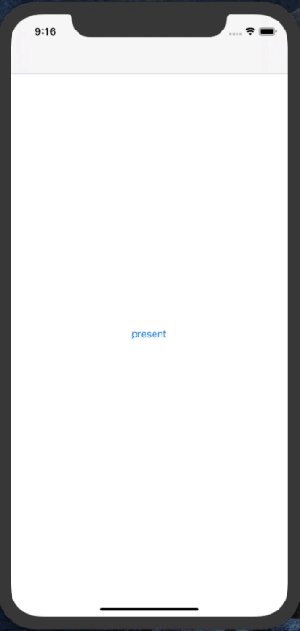

# VerticalSlidingPresentationController

### Overview

VerticalSlidingPresentationController is a custom view controller presentation library which is designed to animate the presented view controller from bottom of the screen. When the presented view controller is showing on the screen, it has two anchor points, one at the lower part of the screen and the other at the upper part, You could scroll the content view of the presented view controller directly to update the origin of the presented view controller so that it can slide between the two anchor points or be dismissed.

### Preview

### Requirements

- [x] Xcode 11.
- [x] Swift 5.
- [x] iOS 11 or higher.
